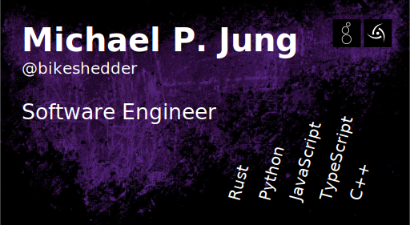

Hi, I'm Michael and I love to write and share software with the world. I deeply believe in the FreeSoftware movement and contribute to projects whenever I can.

## Open source projects

- [webwire](https://github.com/webwire) – Contract-First API System
- [deadpool](https://github.com/bikeshedder/deadpool) – Dead simple pool implementation for rust with async-await
- [deadqueue](https://github.com/bikeshedder/deadqueue) – Dead simple queue implementation for rust with async-await
- [tusker](https://github.com/bikeshedder/tusker) – PostgreSQL migration management tool
- [tusker-rs](https://github.com/bikeshedder/tusker-rs) – PostgreSQL migration management tool (Rust rewrite, WiP)
- [sunspec](https://github.com/bikeshedder/sunspec) – SunSpec Rust implementation

## Links

- [bikeshedder.com](https://bikeshedder.com/) – My personal website
- [Terreon GmbH](https://terreon.de/) – My company
- [PYROX™](https://pyrox.eu/) – Hosting service offered by Terreon GmbH
